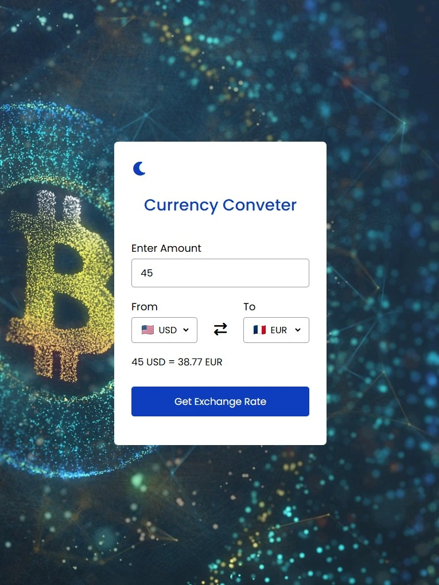
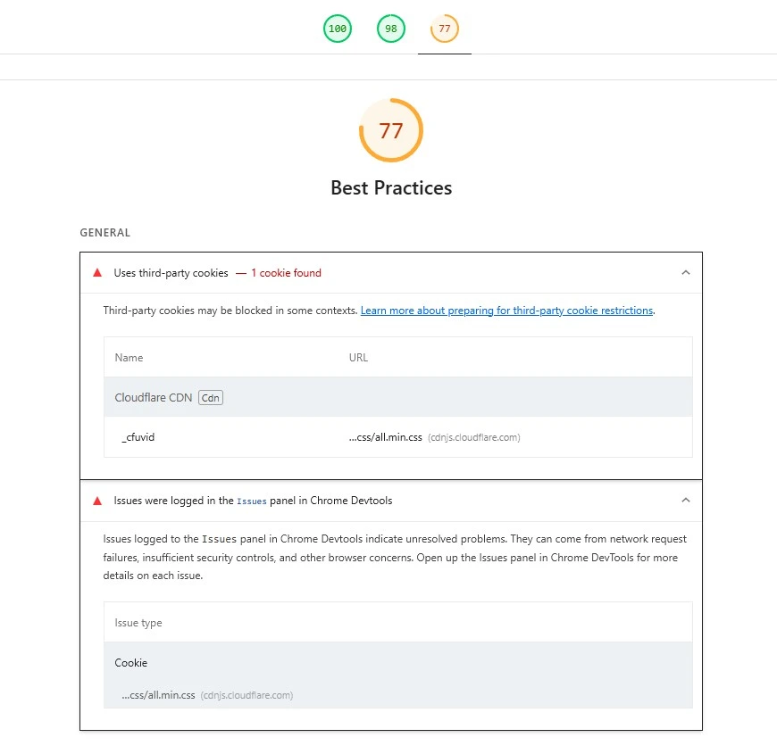
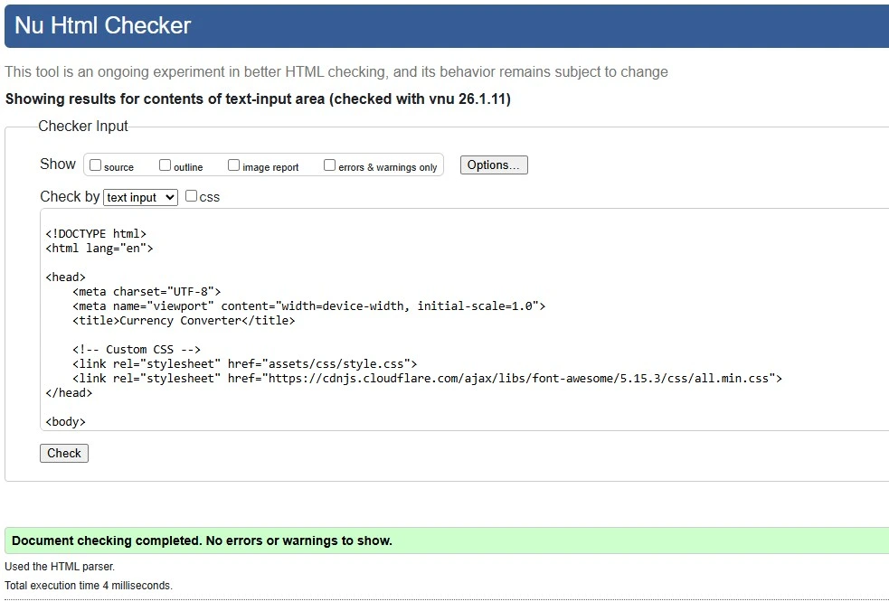
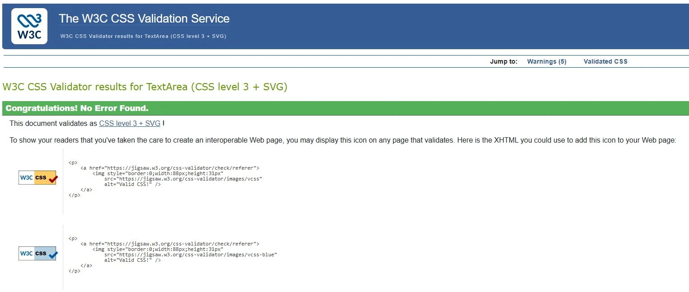

# Exchange Converter

Exchange Converter is a sleek and responsive web application that lets users convert currencies quickly and easily using real-time exchange rates. Built with HTML, CSS, and JavaScript, it demonstrates interactive UI design, API integration, and dynamic DOM manipulation.

---

## Live Demo

> 🔗 [Try Exchange Converter Here](https://gcarravi.github.io/currency-converter/)

---

## Table of Contents

- [Project Overview](#project-overview)  
- [UX/UI Design](#uxui-design)  
- [User Stories](#user-stories)  
- [Features](#features)  
- [Built With](#built-with)  
- [Testing](#testing)  
- [Deployment](#deployment)  
- [Future Features](#future-features)  
- [Known Bugs](#known-bugs)  
- [Credits](#credits)  

---

## Project Overview

The **Exchange Converter App** allows users to:

- Select a base currency and a target currency  
- Input an amount to convert  
- Get real-time exchange rates and converted results  
- See a user-friendly interface that works on all device sizes
- Toggles from light to dark for a better UI experience

This project uses a currency exchange API to fetch up-to-date rates and applies JavaScript to calculate and display the conversion results dynamically.

---

## UX/UI Design

- Clean, intuitive layout with accessible controls  
- Form inputs for currencies and amount  
- Dynamic result display area  
- Error messaging for invalid entries or failed API responses  
- Responsive design for mobile, tablet, and desktop screens
- Day/Night toggle feature

---

## User Stories

As a user, I want to:

- ✅ Enter an amount to convert so that I can calculate the value in another currency
- ✅ Be able to select from and to a complete list of countries globally so that I can convert from and to the correct currency.  
- ✅ Click a button to get the exchange rate so that I can control when the conversion happens. 
- ✅ See the conversion result displayed clearly so that I can easily understand the exchange rate. 
- ✅ See the flag of the selected source and target currency so that I can visually confirm my selection.  
- ✅ The interface to be clean and well-styled so that the application is easy and pleasant to use
- ✅ See a light/dark mode toggle so my user experience is enhanced.

---

## Features

- 💱 Real-time currency conversion  
- 🧠 Validates user input  
- 📊 Displays results dynamically without page reloads  
- 📱 Fully responsive layout  
- ⚡ Minimalist and accessible design

---

## Built With

- **HTML5** – Semantic structure and user interface  
- **CSS3** – Styling, layout, and responsiveness  
- **JavaScript (ES6+)** – App logic, API calls, and DOM updates  
- **Currency Exchange API** – Provides real-time rates (e.g., *Fixer*, *ExchangeRate-API*, *Open Exchange Rates*)

---

## Testing And Validation

### Manual Testing

- 🧪 Tested in latest versions of Chrome, Firefox, and Edge  
- 📱 Checked across various screen sizes for responsiveness  
- 🛠️ Manual testing for user input validation and edge cases  
- 🧾 API error handling verified for offline/unreachable API scenarios

#### Automated Testing

- Lighthouse (Performance, Accesibility and Best Pratices)

Initial report showed low performance ratings  as shown below:

Solution: add labels to all selects and input elements.

These scores reflect a well-optimized and accessible site. Performance may vary slightly across networks or browsers.

#### W3C HTML validator

used [W3C Nu HTML Checker](https://validator.w3.org/)

-> [index.html]: Passed all tests

#### W3C CSS Validator

Used [W3C Schools CSS validator](https://jigsaw.w3.org/css-validator/)

Stylesheets passed validation including use of valid CSS custom properties.

---

## Deployment

Site deployed using [GitHub Pages](https://pages.github.com/) at [Currency Converter](https://gcarravi.github.io/currency-converter/)

-> **Steps to deploy a website using GitHub Pages**

1. Open your github repository
2. Open the settings
3. Select 'Pages' from the side menu
4. Select the branch you want to deploy from the dropdown menu

## Getting Started

1. Open the folder where you would like to clone the project
2. Open a terminal window
3. Enter the following command: <code>git clone https://github.com/gcarravi/currency-converter.git</code>
4. On the terminal start the service locally by executing the following command: <code>python -m http.server --bind 127.0.0.1</code>
5. the command above will give you the following: <code>Serving HTTP on 127.0.0.1 port 8000 (http://127.0.0.1:8000/)</code>. Click on it to see the application running in your local environment.

## License

This project is intended for educational and personal portfolio use only. Not licensed for commercial redistribution.
